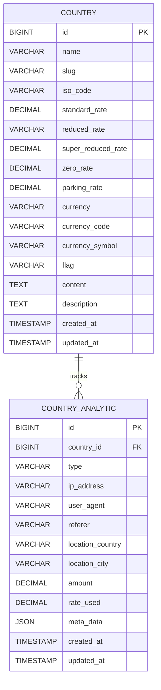

# Database Schema

This document outlines the database schema for the EU VAT Info application.

## Tables

### `countries`

Stores information about EU countries and their VAT rates.

| Column               | Type          | Description                                      | Notes                                     |
| -------------------- | ------------- | ------------------------------------------------ | ----------------------------------------- |
| `id`                 | `BIGINT`      | Primary Key                                      | Auto-incrementing                         |
| `name`               | `VARCHAR`     | Name of the country                              |                                           |
| `slug`               | `VARCHAR`     | URL-friendly slug generated from the name        | Indexed                                   |
| `iso_code`           | `VARCHAR`     | Two-letter ISO code (e.g., 'DE', 'FR')           | Nullable                                  |
| `standard_rate`      | `DECIMAL(5,2)`| Standard VAT rate percentage                     | Nullable                                  |
| `reduced_rate`       | `VARCHAR`     | Reduced VAT rate(s) percentage                   | Nullable, String to handle ranges (e.g. 5/10) |
| `super_reduced_rate` | `DECIMAL(5,2)`| Super-reduced VAT rate percentage              | Nullable                                  |
| `zero_rate`          | `DECIMAL(5,2)`| Zero VAT rate percentage (often 0)             | Nullable (Added later, check migration) |
| `parking_rate`       | `DECIMAL(5,2)`| Parking VAT rate percentage                    | Nullable                                  |
| `currency`           | `VARCHAR`     | Currency name (e.g., 'Euro')                     | Nullable                                  |
| `currency_code`      | `VARCHAR`     | Currency code (e.g., 'EUR')                      | Nullable                                  |
| `currency_symbol`    | `VARCHAR`     | Currency symbol (e.g., '€')                      | Nullable                                  |
| `flag`               | `VARCHAR`     | Path or identifier for the country flag image    | Nullable                                  |
| `content`            | `TEXT`        | Additional content/guide for the country page    | Nullable (Added via migration)            |
| `description`        | `TEXT`        | Short description for SEO/meta purposes        | Nullable (Added via migration)            |
| `created_at`         | `TIMESTAMP`   | Timestamp of creation                            |                                           |
| `updated_at`         | `TIMESTAMP`   | Timestamp of last update                         |                                           |

**Relationships:**

- Has many `CountryAnalytic` records (`analytics()`)

### `country_analytics`

Tracks user interactions and views related to countries.

| Column             | Type           | Description                                       | Notes                               |
| ------------------ | -------------- | ------------------------------------------------- | ----------------------------------- |
| `id`               | `BIGINT`       | Primary Key                                       | Auto-incrementing                   |
| `country_id`       | `BIGINT`       | Foreign key referencing `countries.id`            | Indexed, Cascade on delete          |
| `type`             | `VARCHAR`      | Type of interaction (e.g., 'view', 'calculator', 'saved') |                                     |
| `ip_address`       | `VARCHAR`      | User's IP address                                 | Nullable                            |
| `user_agent`       | `VARCHAR`      | User's browser/agent string                       | Nullable                            |
| `referer`          | `VARCHAR`      | Referring URL                                    | Nullable                            |
| `location_country` | `VARCHAR`      | User's country based on IP lookup                 | Nullable                            |
| `location_city`    | `VARCHAR`      | User's city based on IP lookup                    | Nullable                            |
| `amount`           | `DECIMAL(10,2)`| Amount used in calculator interaction             | Nullable                            |
| `rate_used`        | `DECIMAL(5,2)` | VAT rate used in calculator interaction           | Nullable                            |
| `meta_data`        | `JSON`         | Additional metadata for the interaction           | Nullable                            |
| `created_at`       | `TIMESTAMP`    | Timestamp of the interaction                      |                                     |
| `updated_at`       | `TIMESTAMP`    | Timestamp of last update (usually same as created) |                                     |

**Relationships:**

- Belongs to one `Country` (`country()`)

### Other Standard Laravel Tables

The application also includes standard Laravel tables created by default migrations:

- `users`: For user authentication (potentially for admin panel).
- `password_reset_tokens`: For password reset functionality.
- `sessions`: For session management.
- `cache`, `cache_locks`: For Laravel's caching system.
- `jobs`, `failed_jobs`, `job_batches`: For Laravel's queue system.
- `migrations`: Tracks executed database migrations.
- `pulse_*`: Tables for Laravel Pulse monitoring (if installed).
- `personal_access_tokens`: For Sanctum API authentication.
- `audits`: For tracking model changes using `laravel-auditing`.

## Relationships Diagram (Simplified)

## Further Reading

- [Architecture Overview](./overview.md)
- [Models](../models/)
